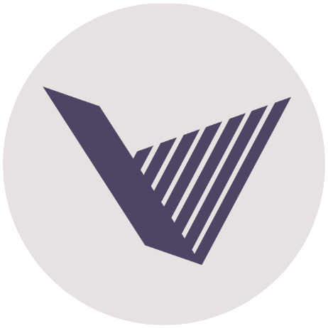
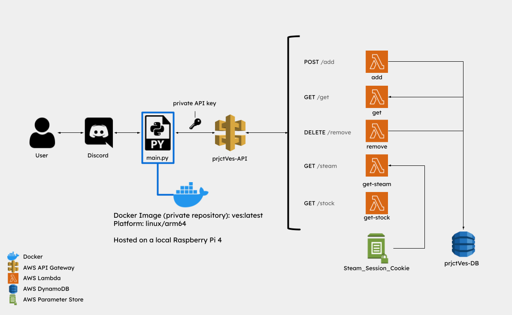
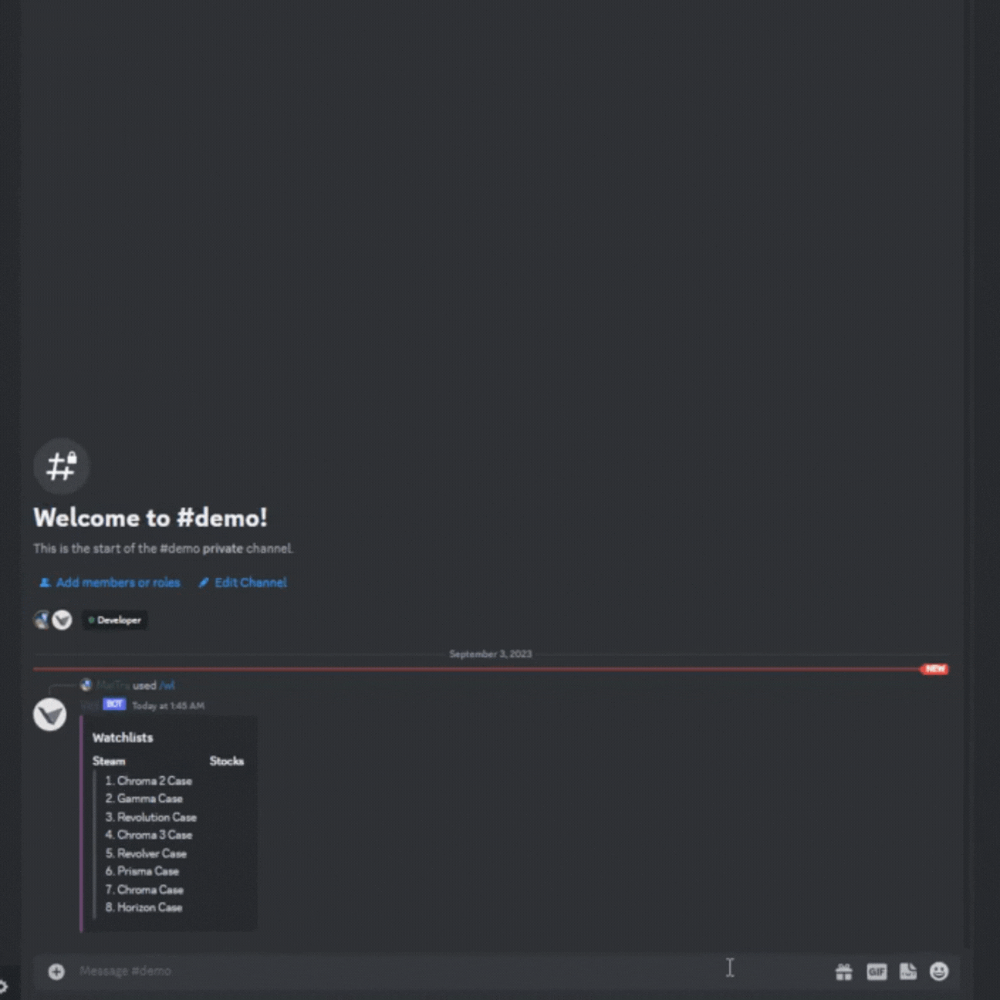

#  prjctVes (Temporarily Offline)

  
Tech Diagram

  

                              
Welcome to the GitHub repository for prjctVes, a Discord bot designed to streamline your stock and CS:GO item tracking experience. With prjctVes, you can effortlessly monitor up to 10 stocks and CS:GO items in your watchlist, gaining valuable insights into their current prices and trends. Additionally, the bot offers a convenient search feature in case you just want to take a quick look. The bot is written in Python using [discord.py](https://pypi.org/project/discord.py/).

More notably, prjctVes incorporates a custom-built REST API, which you can explore in more detail [here](https://github.com/MaiTra10/prjctVes-API).

The inspiration for this project stemmed from my daily routine of manually checking both stock prices and CS:GO item values. I recognized that this was an area for automation and figured why not simplify this process for myself and others by delivering comprehensive data with a single Discord command.

### :thinking: How to Use

*To do either options below you will need a Discord account. if you do not have one, you can create one [here](https://discord.com/register) or take a look at the demos provided.*

**If you would like to invite the bot to your own server** | [Invite](https://discord.com/api/oauth2/authorize?client_id=1121275829448605726&permissions=277294345216&scope=bot)

### :hammer_and_wrench: Functionality and Demos

- 

  
<b>/help</b> | A command to list all the commands of the bot and how to use them

  

- 

  
<b>/wl_add</b> | Used to add an entry to your watchlist

  

    

      
<b>&emsp;Adding Stock and Duplicate Entry Error</b>

      
    

    

      
<b>&emsp;Adding CS:GO Item and Duplicate Entry Error</b>

      
    

    

      
<b>&emsp;Errors</b>

        

          

            
<b>&emsp;&emsp;Invalid Stock/CS:GO Item</b>

            
          

          

            
<b>&emsp;&emsp;Watchlist Limit Reached</b>

            
          

        

    

  

- 

  
<b>/wl_remove</b> | Used to remove an entry from your watchlist

  

    

      
<b>&emsp;Removing Stock/CS:GO Item</b>

      
    

    

      
<b>&emsp;Errors</b>

        

          

            
<b>&emsp;&emsp;Watchlist is Empty</b>

            
          

          

            
<b>&emsp;&emsp;Index is out of Range</b>

            
          

        

    

  

- 

  
<b>/wl</b> | Used to display your watchlists or a specific entry from your watchlist

  

    

      
<b>&emsp;Show Specific Stock/CS:GO Item List</b>

      
    

    

      
<b>&emsp;Show Specific Stock/CS:GO Item Data</b>

      
    

    

      
<b>&emsp;Errors</b>

        

          

            
<b>&emsp;&emsp;Watchlist is Empty</b>

            
          

          

            
<b>&emsp;&emsp;Index is out of Range</b>

            
          

          

            
<b>&emsp;&emsp;User Entry Error</b>

            
          

        

    

  

- 

  
<b>/search</b> | Used to search a stock or CS:GO item

  

    

      
<b>&emsp;Search Stock/CS:GO Item</b>

      
    

    

      
<b>&emsp;Error</b>

        

          

            
<b>&emsp;&emsp;Invalid Stock/CS:GO Item</b>

            
          

        

    

  

